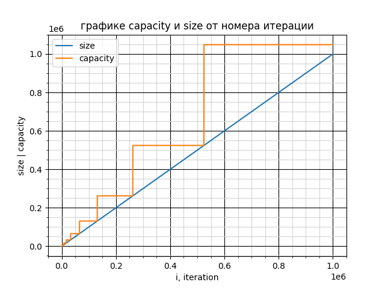
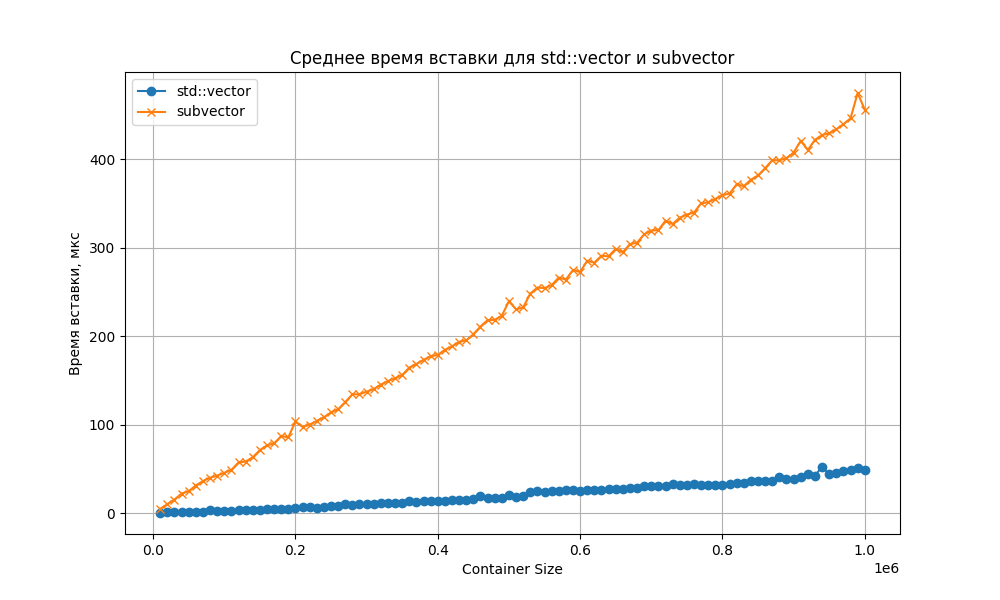
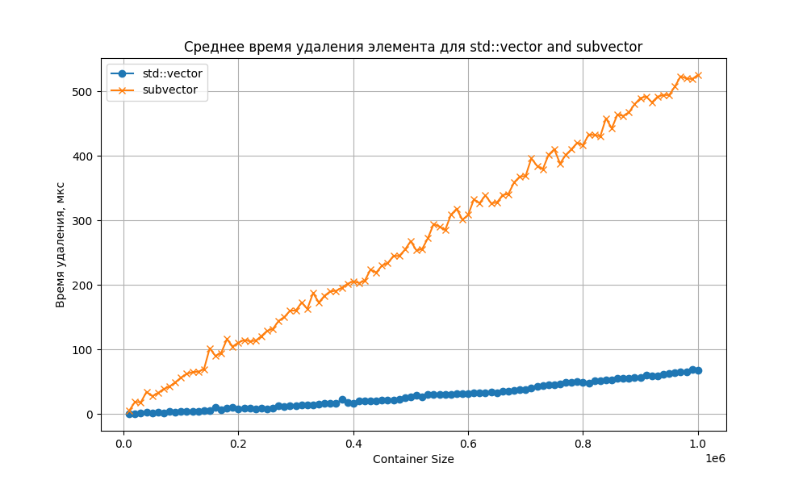
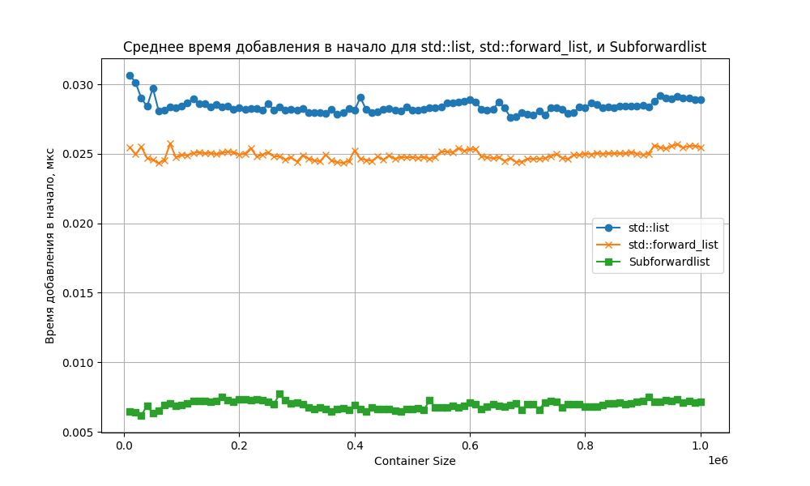
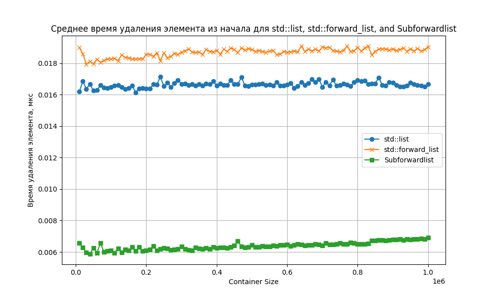
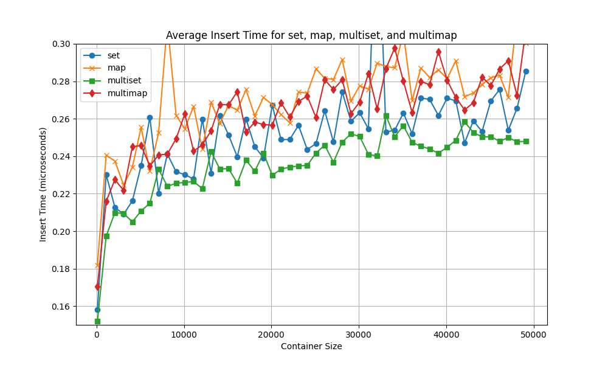
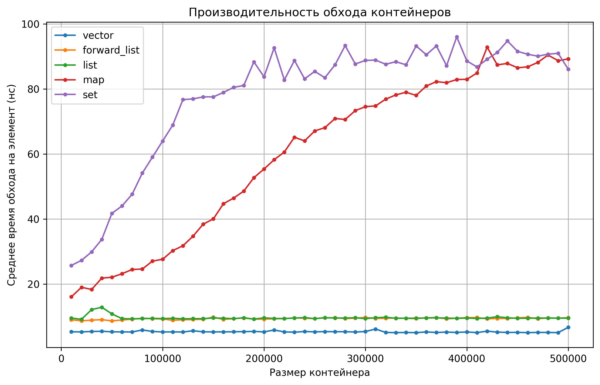

# Лабораторная работа по контейнерам
## пункт 0
Здесь и говорить не о чем, просто проверяем теорию на практике:

Не труно заметить, что size растет линейно, capacity каждый раз увеличивается в два раза начиная с 1.
## Пункт 1 (Среднее время вставки элемента в произвольное место вектора)

Реализуем для сабвектора insert. Сравним с вектором: сразу видно, что сишный вектор быстрее чем самодельный, а ассимптотика у обоих получается O(N) 
## Пункт 2 (Среднее время удаления одного элемента из произвольного места вектора.)

Аналогично с предыдущем пунктом. Ассимптотика O(N)
## Пункт 3 (Среднее время добавления в начало односвязного списка.)

ну тут очевидно, что ассимптотика O(1), потому что взяли ссылку на новым элемент и прикрепили старому "первому" элементу. зависит только от скорости самого контейнера, ну и немного от компа.
## Пункт 4 (Среднее время удаления из начала односвязного списка.)

Ну тут так же аналагично как и в третьем пункте. все O(1). могут возникнуть вопросы к самодельному листу, но он просто говно, поэтому ничего не будем его осуждать.
## Пункт 5 (Среднее время добавления элемента в бинарное дерево.)

Тут конечно полный расколас происходит, но можно кое-что увидеть. Теория гугла говорит о сложности O(log(N)). Это и видно на графике. теория доказана практикой.ну потому что количество узлов удваивается с каждым увеличением размера.
## Пункт 6 (Среднее время обхода всего контейнера.)

Тут я смотрел среднее время поэлементно, поэтому сложность получается для одних O(1), а для map и set как и в прошлом пункте сложность O(log(N)) а от константы не зависит. 
остальные инетерсные графики по ним можно посмотреть в [пункт_6](6).
